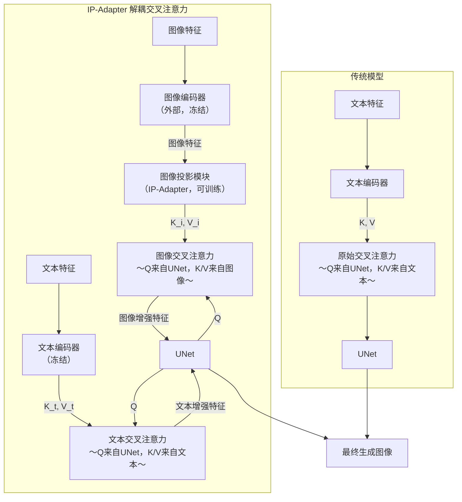

ref:
- [zhihu](https://zhuanlan.zhihu.com/p/3472288872)

![[Pasted image 20260515155450.png]]

传统方案：`Concat[img_feats, txt_feats] -> CrossAttn`
- cross attn可能无法完全理解图像特征

IP-Adapter：
- 总体结构：
	- 编码器基于OpenCLIP的ViT模型：img enc一般用OpenCLIP-ViT系列，txt enc一般用CLIP的原生编码器
	- 图文特征对齐：*图像投影模块*（image projection module）
		- 一个将CLIP图像特征映射到UNet能够理解格式的MLP
		- Plus版会使用*重采样器*（resampler），提取更细粒度的图像特征
		- 文本特征维持原样
	- *解耦交叉注意力*（decoupled cross attn）：文本定骨架，图像定风格
		- U-Net提供Q，K/V来自图像投影模块/文本编码器，计算对应的增强特征
- 训练的参数：图像投影模块、图像交叉注意力

## 解耦交叉注意力-详解

### U-Net如何生成查询

扩散模型的目标是预测噪声，损失函数为：
$$
\mathcal L=\mathcal E_{x_0,\epsilon\sim N(0,I),c,t} \lVert \epsilon-\epsilon_\theta(x_t,c,t)\rVert^2
$$
其中：$x_0$为真实数据，$c$为附加条件，$t$为步数，$x_t=\alpha_t x_0+\sigma_t \epsilon$是第$t$步的噪声（$\alpha_t,\sigma_t$是预先计算/训练的超参数）
- $c$是控制条件，删除之可用于训练无条件扩散模型

推理阶段，通过联合条件模型和无条件模型预测的结果，预测出每一步的噪声：
$$
\hat{\epsilon}_\theta(x_t,c,t)=w\cdot \epsilon_\theta (x_t,c,t)+(1-w)\cdot \epsilon_\theta(x_t,t)
$$

U-Net是一个从wide到deep再到wide的结构，两个wide对应输入和输出端，中间的深层表示

在IP-Adapter中，*图文交叉注意力使用同一套查询*。这个查询来自U-Net当前层的空间特征，生成过程：
- 在某个注意力层，输入是一个规模为`[B,H,W,C]`的特征图。当层次较深时`C`可能达到数十甚至数百
- 展平为`[B,H*W,C]`。每个空间位置对应一个长度为`C`的向量
- 用一个规模为`[C,d_k]`的可学习权重矩阵进行投影，生成规模为`[B,H*W,d_k]`的查询$Q$

### K,V是什么

图像投影模块输出形为`[B,N_img,C_img]`的特征token序列：
- token数量为`N_img`，每个token有`C_img`维特征
- 基础版`N=4`，Plus或V2会更多

图像交叉注意力：
- `K_img`：每个图像token的*视觉模式索引*，即编码了什么特征：暖色调、粗糙纹理、绿色斑点等
- `V_img`：每个图像token的*视觉特征值*，如：颜色直方图抽象、边缘方向统计、纹理滤波器响应，等

文本交叉注意力：
- `K_txt`：每个文本token的*语义身份特征*，即编码了什么概念、文本
- `V_txt`：每个文本token的*语义内容*，关于token的完整语义向量，编码语义对应的文本-视频特征

### 交叉注意力是如何实现风格参考的

$Q$是U-Net模型当前层的空间特征，经过图文加权后分别得到图像和文本的增强特征

这些增强特征融合为新生成图的空间和语义特征，输入到U-Net中