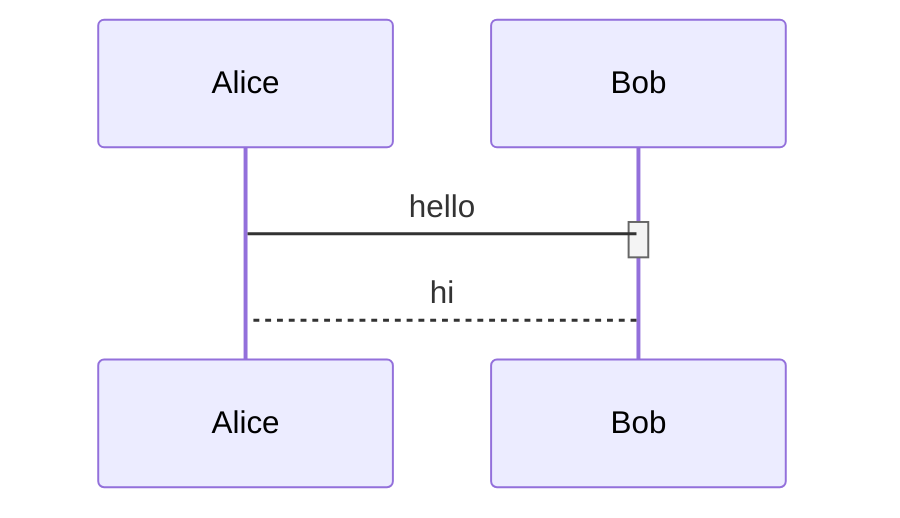
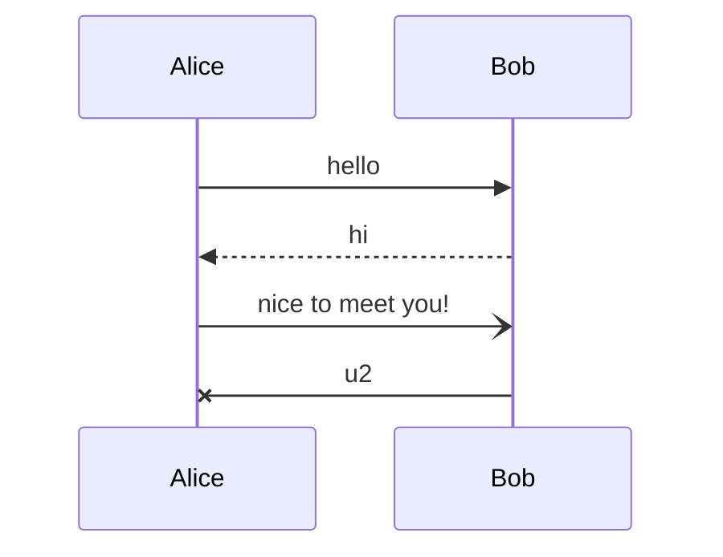
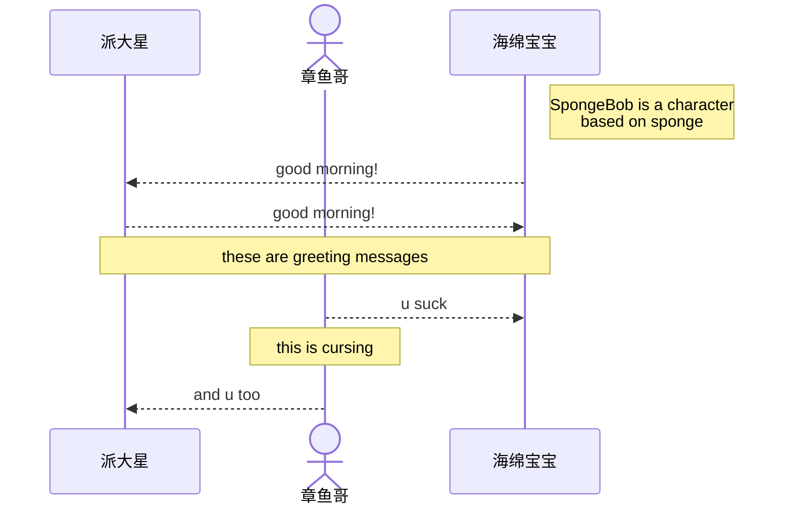
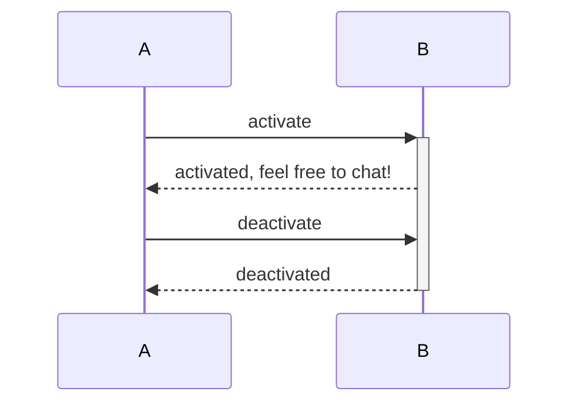
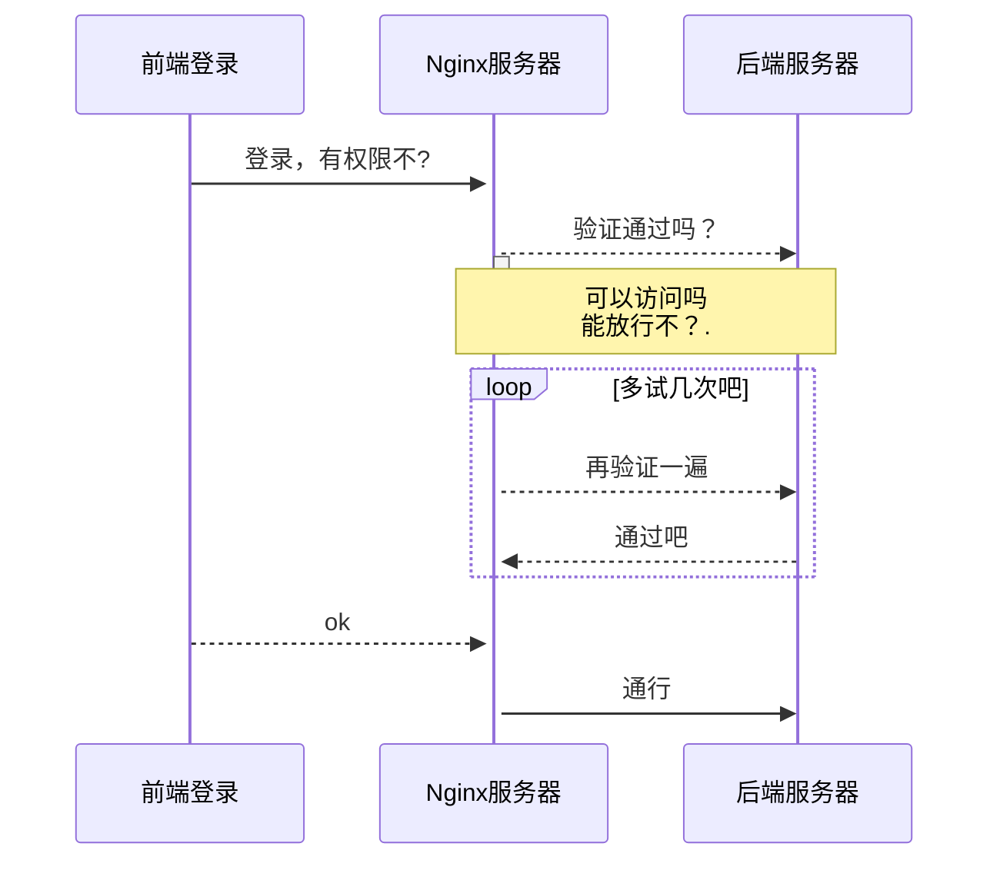
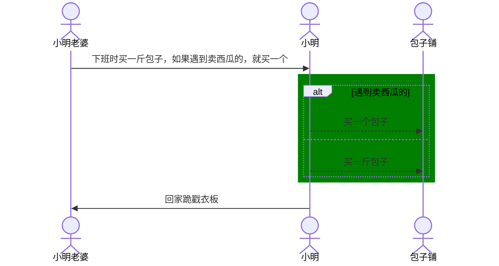

# 时序图UML

## 基本事件

`->`：实线

`-->`：虚线

`->>`：实线箭头

`-->>`：虚线箭头

`-x`：带x实线

`--x`：带x虚线

`-)`：异步箭头实线

`--)`：异步箭头虚线

````markdown

````

效果如下：



## 样式和别名

样式规定了时序图上下端对应角色的图形样式。默认的`participant`是一个钝角矩形，而`actor`则是一个小人。

别名允许我们在图上使用和在Markdown源码中不同的名称。图上的名称不能在源码中使用。

```markdown
participant squid as Squidward
```


## 笔记（Note）

允许在时序图上添加笔记或说明内容。语法：`Note [位置]: [内容]`

位置是笔记添加的位置，可以是类似下列形式的说明：

```markdown
Note left of foo: comment lol
Note right of bar: also comment lmao
Note over foo: comment over foo
Note over foo, bar: bigger comment block
```

下面是一个综合运用别名、角色和笔记的示例：



## 激活

激活机制应用于某个对象，会在对应对象的时间轴上添加区间标识，和取消激活（deactivate）成对使用。语法：

```markdown
// 直接激活
activate [对象]
deactivate [对象]

// 符号激活
+ [对象]
- [对象]
```

一般更常用的是搭配事件的符号激活，如下所示：

```markdown
A-->>+B: activate
B-->>-A: deactivate
```


下面是一个示例：



## 行为逻辑

### 循环：loop

一个循环块，描述一个循环执行的事件序列。语法：

```markdown
loop [循环说明]
	[事件1] [事件2] ... [事件n]
end
```

### 分支：alt/opt

一个分支逻辑块，描述一个有条件判断逻辑的事件序列。语法：

```markdown
alt [条件说明]
	[事件1] [事件2] ... [事件n]
else
	[事件1] [事件2] ... [事件n]
end

opt [条件说明]
	[事件1] [事件2] ... [事件n]
end
```

### 并行：par

一个并行逻辑块，描述一个有并行逻辑的事件序列。语法：

```markdown
par [并行说明]
	[事件1] [事件2] ... [事件n]
and
	[事件1] [事件2] ... [事件n]
end
```

综合使用：



## 局部背景

可以使用`rect [背景色]`的方式让局部事件带有背景颜色。背景色可以是RGB格式也可以是RGBA格式。

```markdown
rect rgba(0, 0, 255, .1) # 蓝,Alpha=0.1
	...
end
rect rgb(0, 255, 0) # 绿
	...
end
```

下面的示例：



